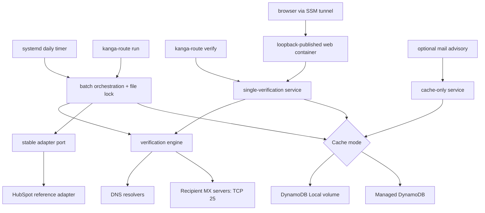

# Kanga-Route Architecture

Kanga-Route is a self-hosted AWS appliance that produces product-neutral email
verification evidence without sending message bodies.

## Verification flow

The engine pages unverified contacts, cooldown-eligible `Unknown` contacts,
and results older than `REVERIFY_AFTER_DAYS`. Syntax and disposable-domain
failures terminate early.
Authoritative DNS absence can produce `Invalid / No_MX`; transient DNS
failures produce `Unknown`. SMTP checks try MX hosts in priority order,
perform opportunistic STARTTLS, test a randomized recipient for catch-all
behavior, and require explicit recipient-not-found evidence before producing
`Invalid / User_Not_Found`.

A global asynchronous semaphore caps concurrent probes across different
customer domains. Unknown results are written back for visibility but not
cached. Definitive results use DynamoDB TTL.

## Product-neutral result contract

The verifier emits a JSON-compatible object through
`VerificationResult.to_dict()`. Its stable fields are `email`, `status`,
`reason`, `mailbox_provider`, `is_role_account`, `mx_records`, `smtp_code`, and
`verified_at`. Enum fields use their documented string values,
`verified_at` remains an ISO-8601 string, and optional fields are represented as
JSON `null`.

`VerificationTarget` carries an adapter-owned `record_id`, an email address, and
optional metadata. `VerificationOutcome` associates a target with its result at
the orchestration boundary and rejects mismatched email addresses. External
record identity is never embedded in verification evidence or cache entries.

Integration adapters own authentication, selection, paging, retries, limits,
errors, and product-specific formatting. For example, the
HubSpot adapter maps the neutral status and reason to custom property names,
renders booleans as lowercase strings, and converts `verified_at` to Unix epoch
milliseconds. This keeps the verification engine reusable by future CRM,
spreadsheet, webhook, and file adapters.

`IVerificationAdapter` is the strict application port. Its only exchanged
values are `VerificationTarget` and `VerificationOutcome`; capabilities and
batch limits are explicit. The runner imports no HubSpot client or error. An
allow-listed registry selects `KANGA_ROUTE_ADAPTER` and only that adapter
validates its settings. See [ADR 0004](adr/0004-stable-adapter-ports-and-fail-open-mail-advice.md)
and the [integration authoring contract](integration-authoring.md).

The dependency boundary is executable: tests reject adapter, CRM, mail, or web
imports from `src/kanga_route/engine`. Adding a service or adapter must not
change the engine. Engine changes are reserved for verification protocols,
evidence, and classification rules.

## Single-address browser boundary

The browser console, `POST /api/v1/verify`, and single-address CLI use one
application service for normalization, cache policy, configuration validation,
and verification. The API accepts only a bounded JSON envelope, uses stable
sanitized errors, and runs blocking verification work behind explicit timeout,
concurrency, and rate limits. Uvicorn access logging is disabled.

The web container is opt-in and published as `127.0.0.1:8080` on the appliance.
It contains no authentication mechanism and is intended only for SSM port
forwarding. Non-loopback exposure remains blocked on the UI-04 TLS/auth design.

`POST /api/v1/advice` is a separate multi-recipient, cache-only boundary for
optional mail integration. Its service has no engine dependency. Misses and
errors return allow advice, and callers must also fail open on transport errors.
The optional Postfix policy process defaults to observe-only `DUNNO` responses.

## Host control plane

Packer installs Docker, an allowlisted application payload, three systemd
units, and the `kanga-route` command. The stack unit starts DynamoDB Local only
when local mode is selected and starts the loopback browser container only when
explicitly enabled. A persistent timer invokes a oneshot run service daily;
journald retains output, and `flock` prevents overlap.

## AWS deployment

Pulumi creates the VPC, public subnet, egress rules, IAM instance profile,
Elastic IP, and EC2 instance. It requires a Kanga-Route AMI ID rather than
falling back to Ubuntu, requires IMDSv2, encrypts the root disk, and exposes no
SSH ingress unless a restricted CIDR is explicitly configured. SSM Session
Manager is the default administration path.

Outbound port 25 still requires AWS account approval, and operators must align
the appliance Elastic IP with forward DNS, reverse DNS, and the configured SMTP
identity.
