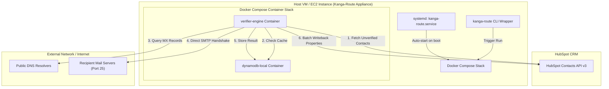

# Kanga-Route Architecture Overview 📐

Kanga-Route operates as a **Containerized Virtual Appliance**. The application logic is fully containerized, but deployed via pre-baked Amazon Machine Images (AMIs) to bypass the outbound networking restrictions typical of serverless cloud platforms.

---

## System Architecture Topology

---

## 1. The Container Layer (Docker Compose)
* **The Verification Engine:** A lightweight Python container responsible for paging the HubSpot API, evaluating the 4-layer validation sequence (Regex, Blocklist, DNS, SMTP socket with STARTTLS and Catch-All dummy check), and batch-updating the CRM.
* **The Cache (DynamoDB Local / Cloud):** A sidecar container running `amazon/dynamodb-local` (or managed AWS DynamoDB). It stores verification statuses and timestamps to prevent redundant SMTP connections on static emails, saving bandwidth and protecting the host's IP reputation.

---

## 2. The Host OS Layer (Packer-Built VM)
* **The OS:** A lightweight, standard Linux distribution (Ubuntu Jammy 22.04 LTS).
* **The Orchestrator:** The host OS runs a native systemd service (`kanga-route.service`) that automatically starts the Docker Compose stack the moment the VM boots.
* **The Control Plane:** A bash wrapper script (`/usr/local/bin/kanga-route`) is baked into the OS. It allows engineers to easily trigger manual Docker runs (`kanga-route run`), view container status (`kanga-route status`), inspect logs (`kanga-route logs`), and update cron schedules (`kanga-route schedule`).

---

## 3. The Cloud Network Subsystem (AWS VPC)
* **Elastic IP & rDNS:** A static public IP is attached to the host VM, mapped to a verified Reverse DNS (PTR) record. Major mail providers will drop SMTP handshakes from IPs lacking proper rDNS.
* **Port 25 Unblocking:** The host VM's network security groups allow outbound TCP Port 25. *(Note: AWS requires a support ticket to unblock this port at the account level)*.