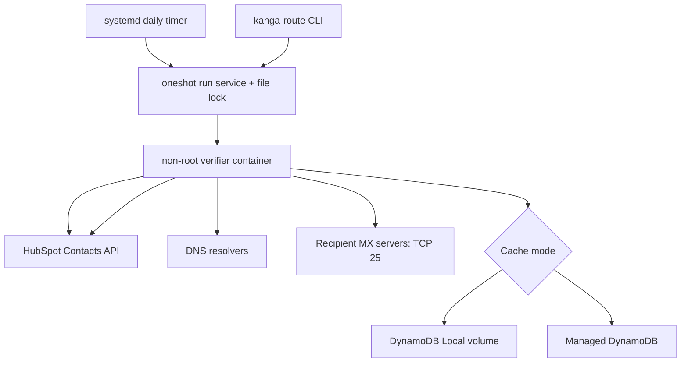

# Kanga-Route Architecture

Kanga-Route is a self-hosted AWS appliance that verifies HubSpot contact email
addresses without sending message bodies.

## Verification flow

The engine pages unverified contacts, cooldown-eligible `Unknown` contacts,
and results older than `REVERIFY_AFTER_DAYS`. Syntax and disposable-domain
failures terminate early.
Authoritative DNS absence can produce `Invalid / No_MX`; transient DNS
failures produce `Unknown`. SMTP checks try MX hosts in priority order,
perform opportunistic STARTTLS, test a randomized recipient for catch-all
behavior, and require explicit recipient-not-found evidence before producing
`Invalid / User_Not_Found`.

A global asynchronous semaphore caps concurrent probes across different
customer domains. Unknown results are written back for visibility but not
cached. Definitive results use DynamoDB TTL.

## Host control plane

Packer installs Docker, an allowlisted application payload, three systemd
units, and the `kanga-route` command. The stack unit starts DynamoDB Local only
when local mode is selected. A persistent timer invokes a oneshot run service
daily; journald retains output, and `flock` prevents overlap.

## AWS deployment

Pulumi creates the VPC, public subnet, egress rules, IAM instance profile,
Elastic IP, and EC2 instance. It requires a Kanga-Route AMI ID rather than
falling back to Ubuntu, requires IMDSv2, encrypts the root disk, and exposes no
SSH ingress unless a restricted CIDR is explicitly configured. SSM Session
Manager is the default administration path.

Outbound port 25 still requires AWS account approval, and operators must align
the appliance Elastic IP with forward DNS, reverse DNS, and the configured SMTP
identity.
