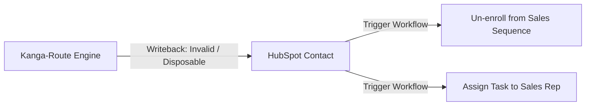

# HubSpot User Story & Sales Workflow 🎯

This guide explains how Kanga-Route protects domain reputation, automates HubSpot CRM workflows, and provides accurate sales analytics for non-technical users and RevOps teams.

---

## 1. Protecting Domain Reputation & Preventing Account Suspensions

Sales reps rely heavily on connected inboxes and domain reputation to ensure outreach emails land in a prospect's primary inbox rather than the spam folder. 

HubSpot enforces a strict deliverability protection threshold: **if an account hits a hard bounce rate of just 5%, email sending privileges can be suspended entirely**. 

By catching invalid domains and dead MX records before an email is ever dispatched, Kanga-Route protects your company's sender score, prevents account suspensions, and keeps outreach operational.

---

## 2. Automated Sequence Un-enrollment via Granular Writebacks

Because Kanga-Route writes rich intelligence back to custom HubSpot contact properties (`email_verification_status`, `email_verification_reason`, `mailbox_provider`), RevOps teams can build powerful automated workflows:

- **Automatic Sequence Removal**: When a contact is flagged as `Disposable` or `Catch-All`, HubSpot automatically un-enrolls the contact from active Sales Sequences.
- **Task Assignment**: Automatically creates a task for the sales rep to find an updated, verified point of contact.

---

## 3. Cleaner Analytics and Higher Engagement Metrics

Email deliverability functions as a continuous feedback loop. Spam complaints and high bounce rates damage a domain's sending reputation over time. 

By ensuring outreach only targets verified, valid addresses, sales reps see artificially inflated bounce metrics disappear. This leads to accurate open and click-through rates, allowing the team to measure what outreach content actually resonates with prospects.
