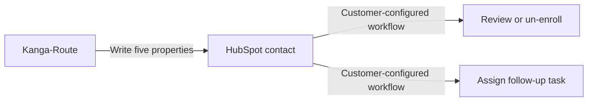

# HubSpot User Story and Sales Workflow

Kanga-Route is a self-hosted verification appliance for RevOps teams. It
classifies HubSpot contact email addresses before sales outreach and writes the
evidence back to five contact properties.

## What Kanga-Route automates

On each scheduled run it:

1. fetches new, retryable, and stale contacts;
2. checks syntax, role accounts, disposable providers, DNS/MX, SMTP recipients,
   and catch-all behavior;
3. caches only definitive outcomes; and
4. writes status, reason, provider, role-account flag, and verification time
   back to the matching HubSpot contact.

Transient network and policy failures remain `Unknown`; they are never
promoted to `Invalid` without authoritative evidence.

## What the HubSpot administrator configures

Kanga-Route supplies the properties, not the business workflow. A HubSpot
administrator can create workflows such as:

- un-enroll contacts when status is `Invalid`;
- route `Catch-All` contacts for manual review;
- retry or review `Unknown` contacts rather than suppressing them; and
- assign a task to find a replacement address.

Keeping that responsibility in HubSpot lets each sales organization choose its
own risk policy while Kanga-Route remains a focused verifier.
